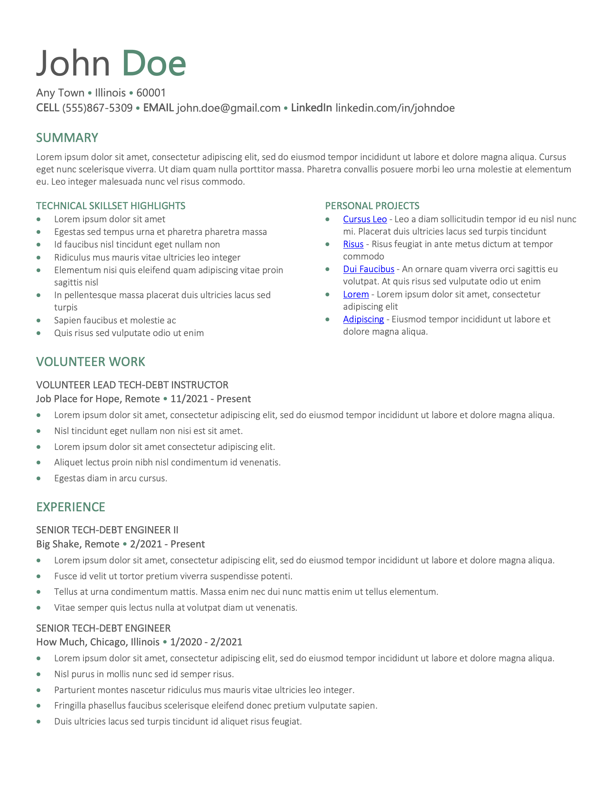

# Abstrak
Easily generate focused resumes with consistent styles

### TODO:
- Figure out how we can decouple the strucute without creating a whole new markup language....

## Requirements
- Python=>3.9.9
- PyYAML==6.0
- lxml==4.7.1
- python-docx==0.8.11
- jmespath==0.10.0

## Getting Started
```sh
# Clone the repo and enter the directory
dylanturnbull@Dylans-MBP % git clone https://github.com/dylanturn/abstrak.git

# Enter the Abstrak directory
dylanturnbull@Dylans-MBP % cd abstrak

#Create the virtual environment
dylanturnbull@Dylans-MBP abstrak % python3.9 -m virtualenv venv

# source the virtual environment
dylanturnbull@Dylans-MBP abstrak % source venv/bin/activate

# Install the requirements
(venv) dylanturnbull@Dylans-MBP abstrak % pip install -r requirements.txt

# Generate a resume!
(venv) dylanturnbull@Dylans-MBP abstrak $ python src/generate.py example-resume-data.yml example-resume-style.yml example-resume.docx
```

## Example Resume
